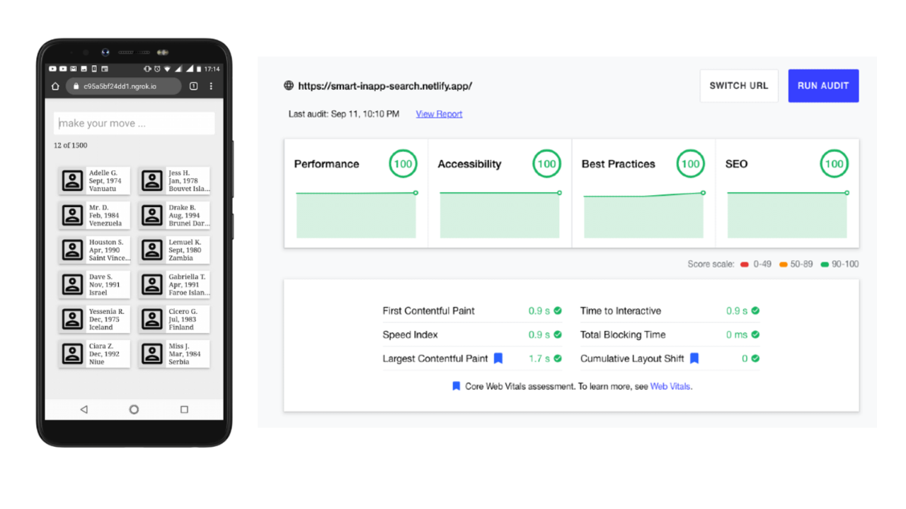

# Smart Search

 

> Performant way to load large data into frontend apps and intuitively query such data. See it live at [https://smart-inapp-search.netlify.app](https://smart-inapp-search.netlify.app)

Imagine fetching data from REST API without pagination support, and you end up with 50k records of developers. Imagine needing to query all 50k records for developers born in August, or everyone except those born in the 3rd quarter of the year i.e `@dob = Aug` and `@dob != Q3`

This app attempts to do these and more, including being a PWA that is snamrt enough to respect network conditions and the user's data saver preferences. E.g: 
*   don't load developer profile images on 2G connectons
*   no high-res images on data saver mode

> This still work in progress
