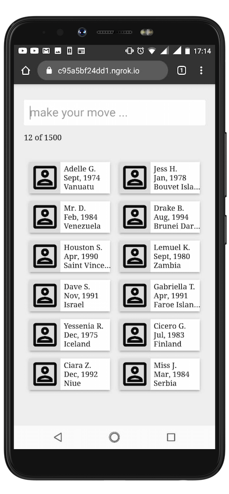

# Smart Search

 

> Performant way to load large data into frontend apps and intuitively query such data. See it live at [https://smart-inapp-search.netlify.app](https://smart-inapp-search.netlify.app)

> This Is Still Work In Progress

Imagine fetching data from a REST API without pagination support, and you end up with 50k records in your app. How might a frontend app handle loading and displaying such data. Imagine needing to search all 50k records for entries of people (they are developers) born in August, or everyone except those born in the 3rd quarter of the year. Something like entering a query like `@dob = Aug` or `@dob != Q3` into a search field that gives you auto-complete suggestions for the query you are about to type, and then returns matching records as fast as possible, but without ever impacting UX (e.g user can scroll while the search is on-going).

The assumption is that you have no control over the server's response and cannot design your way around what is sent from the server, so you must tackle all issues from within the frontend application.

This app will be a PWA that attempts to do these and more. It should be smart enough to respect network conditions and the user's data saver preferences.

## Current Features

*   Search by year or birth. E.g `@dob = 1989`
*   Uses a custom built index for faster searching. On very memory constrained deveices, this index can be outsourced to an external in-memory store like redis
*   Uses custom built *binary search* algorithm to match a collection of records and achieve `O(log n)` time complexity while searching over the large dataset
*   Uses custom built *array-view* and *array-partition* data structures to significantly improve memory usage and prevent unecessary copying of data from the main dataset

## TODOs

*   Add support for more query operators. That is, support (>, >=, <, <=, !=). E.g `@dob >= 1985`

*   Support searching by month of birth, day or birth, quarter of birth and half or birth (i.e H1 oe H2)

*   Support searching by tech tags which often represent stacks, languages, or tools the developer has experience in

*   Support search by competence level. supported levels (in increasing order of competence) are:
    *   Have No Idea
    *   Heard About It
    *   Learning It
    *   Learnt It
    *   Building With It
    *   Built With It
    *   Deployed It
    *   Can Mentor On It
    *   Can Consult On It

    With the above, a query like `#React = Built With It` means `show me developers who have built a React app`. Similary, a query like `#React >= Deployed It` means `show me developers who have buit and deployed a React app to production and are experienced enough to consult on React`

*   support HTTP streams and allow the app to switch between bulk data fetch and streams

*   No profile images on 2G connectons

*   No high-res images on data saver mode

*   Paginate over the data by clicking arrows on the far left/right on desktop

*   Paginate over the data by swiping left/right on mobile

*   Enable pagination over search results when they exceed the page size

*   Record count (i.e 12 of 1500) should reflect search results and indicate page being viewed

